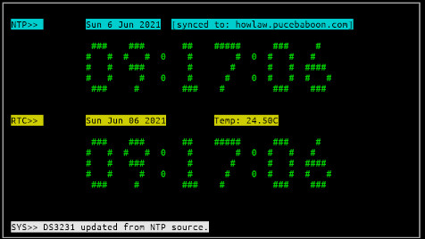

# ESP-DigiClock
Set your I2C RTC module time from an **NTP-synced** ESP8266 with this old-school curses-based digital clock.

## What is it?
At the most basic level, this simply allows you to set the time on an RTC from an **NTP-synced** ESP8266.

This is a dual clock display, with the top display showing (NTP controlled) system time and the bottom showing the time from an i2c-connected, DS3231 RTC chip.  There are three status lines (in addition to the actual clocks).  The NTP and RTC status lines will display the current date information, but only if NTP is synced in the case of the NTP status and only if an RTC is detected as being both present and running in the case of RTC status.  The NTP status line will also display the host to which the ESP is currently synced.  The bottom line on the clock display is the system status line and will display general debug info.

There is no menu, or command prompt with the current version, but entering "q", followed by a carriage-return will quit the clock display and put you back into the "Telnet" menu.  Entering "r" followed by a carriage return will set the RTC date and time to the NTP-synced ESP time.

## Dependencies

#### !! IMPORTANT !!
While sanitizing this code for upload, I "broke" telnet and couldn't work out what I'd done.
  I went back to a known good snapshot and it *still* wouldn't work (telnet just failed to start).
  It turned out that an upgrade to the ESP8266 core code pushed out while I was making my changes caused problems with the TelnetStream library.
  So, if you download this repo and build the code, look out for a non-fatal compiler error warning of a redefine of "UDP_TX_PACKET_MAX_SIZE".
  If you see "#define UDP_TX_PACKET_MAX_SIZE 8192", it's borked and TelnetStream will silently fail.
  A quick fix for this is to find the TelnetStream library (generally under .pio/libdeps/ in your PlatformIO project directory) and edit the src/NetTypes.h file to comment-out the offending lines, starting at line 29:-
~~~

//  #elif __has_include(<Ethernet.h>)
//  #include <Ethernet.h>
//  #define NetClient EthernetClient
//  #define NetServer EthernetServer

~~~

If you're using PlatformIO (and you should be!), the dependencies will automatically be handled by the included platformio.ini file.  If you're using some other, stone-age build environment, these are the libraries which ESP-DigiClock uses:-

+ **Mcurses  --**  Mcurses is a very tiny subset implementation of curses, the screen-handler library, intended for embedded use.  It allows for simple line graphics and lightweight control of a display (such as a VT220 character-based terminal or, something probably more familiar to modern-day readers, an xterm window on an X11 display).
Note that there is an minor bug with this version of mcurses which prevents the graphics character set from initializing correctly, so I've included the mcurses package under the library directory (meaning that you *don't* need to download it yourself).  The mcurses library was written by "Frank M" (https://www.mikrocontroller.net/articles/MCURSES), and the Arduino port was done by "ChrisMicro" (https://github.com/ChrisMicro/mcurses).
+ **Ticker  --**  The Ticker library handles timing for all of the different tasks which the ESP performs.  See below for limitations if you intend to add code. The Ticker library was written by Stefan Staub (https://github.com/sstaub/Ticker).
+ **TelnetStream  --**  The TelnetStream library provides a basic telnet server process on your ESP, so you can connect to it across the network *without* using a browser.  The TelnetStream library comes from Juraj Andrassy (https://github.com/jandrassy/TelnetStream).
+ **TimeLib  --**  TimeLib is Paul Stoffregen's version (https://github.com/PaulStoffregen/Time) of Michael Margolis' venerable Time library, which allows you to manipulate values which we humans understand relatively easily (a minute, second, month or year, for instance) using something which is relatively easy for computers to handle; seconds since "the Epoch".
+ **RTClib  --**  RTClib is Adafruit's version (https://github.com/adafruit/RTClib) of "Jeelab's fantastic RTC library" and it allows us to easily handle the communication of the time values mentioned above between a real-time-clock module and an ESP8266.

ESP-DigiClock provides a simple, telnet-based command-line interface on your ESP.
  That is, the ESP connects via WiFi to your network (as normal) and you can then use old-school (insecure, but simple and lightweight) telnet to connect to the ESP and use a simple menu to execute basic tasks.
  All you need is a telnet client (which is bundled with virtually all existing Linux/BSD distributions ...or "putty" on Windows). 
  The simple menu system will work reliably with most, normal terminals (if, on the other hand, you have something like a 3-column by 200-row display, your experience may not be optimum ...ever!), but the "curses" mode demo works best with a window set to VT220 emulation mode (if you don't know what that means just congratulate yourself for being so young and carry on anyway ...nothing will blow up [uhhh, don't hold me to that promise if you intend to run a nuclear power station with your ESP8266, okay?]).

Because ESP-DigiClock uses the Ticker library to handle timing, you basically have a very simple multi-tasking system in your ESP.  It doesn't run anything simultaneously, but it does allow for other tasks to carry on running if the "current" task happens to be sitting in a wait loop of some sort.  This is by no means bullet-proof, but Ticker call-backs give you much more flexibility than a blocking delay() call.  The only down side is that you must not *ever* call "delay()" itself anywhere (including from libraries) in your program.

##### HARDWARE
This program is built for some very specific hardware.  You obviously should have a DS3231 RTC connected via i2c to utilize the full functionality.  However, the system clock will run and display quite happily even if you don't (and even if you're not actually using NTP).

The hardware which I'm using is an ESP01S with the i2c bus mapped to GPIO1 and GPIO2.  The serial RX pin is also remapped to be a standard GPIO pin and is used by the ESP8266 to control it's own power supply via a p-channel MOSFET, latching the power on when it receives a brief power connection (from either as momentary switch, or from the alarm signal on the DS3231 activating the MOSFET) and turning it's own power off, once the current (pun intended) task is complete.

Once the ESP01S is programmed and installed in its permanent location, the RX pin is used as the power-latch pin so that the ESP can maintain power to itself, even when the RTC alarm signal (the wake-up signal) is removed.  This means that a normal serial connection to the board will no longer work as input/output (the TX "output" will still work, but the RX "input" will not).  The firmware contains a minimal telnet server, to provide this input/output (and debug) functionality over the network.

### SOFTWARE

#### How do I use it?
After compiling and uploading the firmware to your ESP8266, you can connect to it using the "telnet" command from a terminal window (ie:- xterm or putty).  Once connected to the ESP you can simply type "h" (or "?") for help, to get a listing of the available commands.  You will see the following menu:-

+  c  -- Clock (NTP and RTC).
+  e  -- Display ESP01S status
+  h or ?  -- This help screen.
+  i  -- Start i2c detection of devices.
+  n  -- Trigger NTP update from remote server.
+  p  -- Toggle the MOSFET power latch to \"OFF\".
+  q  -- Quit.
+  r  -- Set the DS3231 RTC time/date from NTP.
+  s  -- Display current WiFi status.
+  t  -- Time (display time and date).

While "c" and "h/?" are fairly obvious, some of the other options in the menu need some explanation.  Most of them are debug/helper functions.

+ "e" will display some limited status from the ESP8266.  The most important of these is the heap size, which can indicate a memory leak in the application.
+ "i" will run the I2C probe routine and print out a simple table of addresses found.
+ "n" will request an update from the NTP server and will display the time and date once the reply is received.
+ "p" is specific to my own hardware implementation and will toggle the power to the ESP8266 by switching the state of the supply MOSFET.
+ "q" to quit (*also works from within the clock display to return to the telnet menu*).
+ "r" will update the RTC time and date from the current, NTP-synced, ESP8266 time and date.
+ "s" will display which access point and channel the ESP8266 is currently connected to.
+ "t" will display the current time and date on the command-line (that is, *not* the digital clock display).

As noted above, the "q" option works to stop the digital clock display and return to the telnet menu, as well as to quit from the telnet session itself.  Using quit in this way is the preferred method to exit the application.  Interrupting or terminating the telnet session while the digital clock display is running will most likely leave your screen session in an unusable state.  You need to be aware that, although the display isn't operating correctly, keyboard input **is**, so be careful!  The best way to regain control of the screen is to type Control-J, "reset", Control-J (no commas, hyphens or spaces).

The application requires that you configure the following settings in src/user_config.h.  These are specific to your location.

**YOU MUST** configure at least... 

+ **ntpServerName  --**  This is the fully-qualified hostname of the NTP server you wish to sync to (for instance, pool.ntp.org).

+ **timeZone  --**  This should be a positive or negative number, denoting the offset of your location from UTC-0 (for instance, -3.5 ...looking at you, Newfoundland!).

##### ISSUES

###### Unset or incorrectly set ntpServerName
Failing to set the NTP server name in user_config.h will result in the incorrect time displaying in the NTP clock (surprise!).  It will also result in slow and intermittent updates to the clock, as the application will be spending a disproportionate amount of time trying to contact the server.  Worse still, it will become very difficult to use the OTA (over-the-air) update function (usually, briefly disconnecting the ESP from power and then retrying the upload in the first few seconds following reconnection will result in a successful upload).

###### No RTC (DS3231) module detected
The RTC display will display all zeros if the RTC is unavailable (for whatever reason).  The status line at the bottom of the display will display the message "DS3231 flagged as -not- running" and will update every couple of seconds.  This doesn't affect the NTP clock display and is generally harmless.

###### When I exit the program, my terminal is left in a strange, unusable state
The digital clock display can be exited by inputting a "Q" character, followed by a carriage-return.  A second "Q" and carriage-return will exit you cleanly from the application and (normally) return your terminal to its previous settings.  If that doesn't happen, you can try using the sequence "control-J reset control-J" (with no spaces) to force your terminal to reset.  If you still can't see anything, try doing "carriage-return control-and-open-square-bracket q" to ensure that you're disconnected from the telnet session.

###### Can't use OTA (Over The Air) updates consistently
Try stopping the digital clock display before requesting an OTA update (if the clock is displaying valid NTP and RTC times, it can be too busy with terminal updates to catch an OTA request).  Also see the note on "Unset or incorrectly set ntpServerName", above.

###### The RTC always resets to the same date/time at power-on (not the current date and time).
The RTC initialization code will automatically check to see whether the DS3231 has flagged an oscillator-stopped condition at start-up.  If so, it will try to set the date and time from NTP (if NTP is already available), or it will set it from the compile-time of the binary.  This latter case is probably what you're seeing and the usual cause of this is a dead, or missing, RTC battery.

###### Crud
Yes, I know.  The current version does have more than its fair share of crud liberally mixed into the code.
  For instance, my specific hardware implementation is an ESP01S with an RTC controlled P-MOSFET power switch (the RTC switches it on at set intervals to power-up the ESP01S and then the ESP itself turns the MOSFET off again when the set tasks are completed), so not only is there code for the power switch latching, but also (because of the ESP01S' lack of I/O pins) some added mucking around with re-assignment of UART pin functions, too.
  All of this is totally unnecessary and just confusing for normal users with a standard ESP8266, so once I get things working reasonably consistently, I'll take an axe to some of it.

